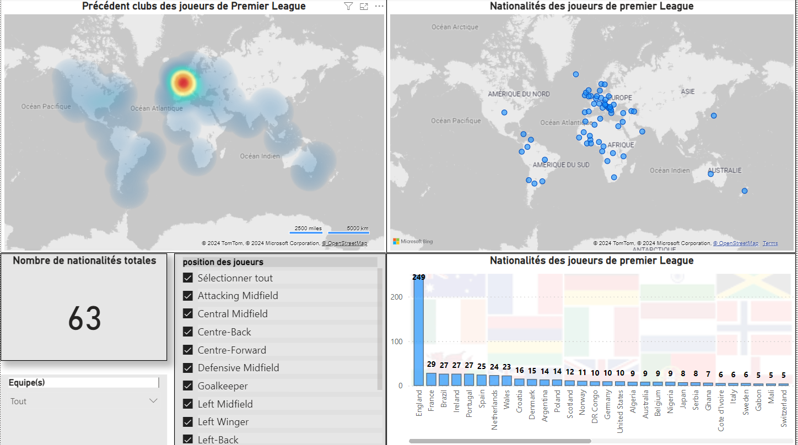

```{r setup, include=FALSE}
knitr::opts_chunk$set(echo = FALSE, warning = FALSE, message = FALSE)
```
# Introduction

Nous avons décidé d'orienter notre projet sur la Premier League, qui est la première division de football en Angleterre. La Premier League fait partie des 5 grands championnats avec la Ligue 1 (France), la Liga (Espagne), la Bundesliga (Allemagne) et la Serie A (Italie).

Nous allons utiliser une librairie qui contient une multitude de fonctions qui requièrent, en fonction des requêtes, une des 3 API des sites suivants : FBref, Transfermarkt et Understat. Le lien qui décrit la librairie et toutes ses fonctionnalités est le suivant : [worldfootballR](https://jaseziv.github.io/worldfootballR/articles/extract-fbref-data.html)

Les sources sont tirées de FBref, Transfermarkt et Understat.

**FBref** est un site web qui fournit des statistiques détaillées sur les joueurs et les équipes de football, y compris des données sur les passes, les tirs et les actions défensives.

**Transfermarkt** est un site web qui se concentre sur les transferts de joueurs de football, les évaluations de joueurs et les rumeurs de transfert. Il fournit également des informations sur les clubs et les compétitions de football.

**Understat** est un site web qui fournit des statistiques avancées sur les joueurs et les équipes de football, y compris des données sur les tirs, les passes et les actions défensives.

Bien que notre sujet soit le championnat anglais, nous pourrons également être amenés à le comparer aux autres championnats majeurs, afin de voir si les préjugés sur cette ligue sont fondés ou non.

Étant donné que la librairie que nous utilisons nous donne accès à un nombre gigantesque de données, nous avons décidé de n'utiliser que les données nécessaires pour répondre à nos questions de recherche. Cela nous permettra de nous concentrer sur les informations pertinentes et de ne pas être submergés par des données inutiles.

Lorsque l'on effectue des requêtes sur une API, il est fréquent d'être limité dans le nombre de requêtes que l'on peut effectuer dans un certain laps de temps. Dans ce cas, nous stockerons les données récupérées dans des fichiers CSV afin de pouvoir les réutiliser ultérieurement sans avoir à effectuer de nouvelles requêtes et de ne pas dépendre de l'API en cas de panne ou de changement dans les données fournies.

**Présentation des données**
Le jeu de données nous permet d'obtenir des informations à plusieurs échelles :

**À l'échelle des saisons**
On peut retrouver à l'échelle des saisons des données sur les équipes et les joueurs grâce à la méthode `fb_big5_advanced_season_stats()`, par exemple, pour obtenir la possession des joueurs en 2021, on peut utiliser la commande `fb_big5_advanced_season_stats(season_end_year=2021,stat_type="possession",team_or_player="player")`, qui nous renverra le dataframe des joueurs avec les informations suivantes :

- `Squad` : le nom de l'équipe du joueur, donnée nominale
  
- `Player` : le nom du joueur, donnée nominale
  
- `Nation` : la nationalité du joueur, donnée nominale
  
- `Pos` : le poste du joueur, donnée nominale
  
- `Age` : l'âge du joueur, donnée quantitative
  
- `Born` : la date de naissance du joueur, donnnée nominale
  
- `Mins_per90` : le nombre de minutes jouées par match, donnée quantitative
  
- `Touches_Touches` : le nombre de touches de balle par match, donnée quantitative
  
- `Touches_Def_Pen` : le nombre de touches de balle dans la surface de réparation adverse par match, donnée quantitative
  
- `Succ_percent_Dribbles`: le pourcentage de réussite des dribbles par match, donnée quantitative

Cette liste n'est pas exhaustive, car il y a en réalité 32 colonnes dans le dataframe, mais cela donne une idée des informations que l'on peut obtenir et surtout de ce que nous allons avoir besoin pour répondre à nos questions.

**À l'échelle des équipes**
On peut retrouver à l'échelle des équipes diverses données grâce à la méthode `fb_team_match_log_stats(team_urls, stat_type)` qui nous renverra le dataframe des équipes avec les informations suivantes :

- `Team` : le nom de l'équipe, donnée nominale
   
- `Date` : la date du match, donnée nominale
  
- `Time` : l'heure du match, donnée nominale

- `Comp` : la compétition, donnée nominale
  
- `Round` : le tour de la compétition, donnée nominale
  
- `Day` : le jour du match, donnée nominale
  
- `Venue` : le lieu du match, donnée nominale
  
- `Result` : le résultat du match, donnée nominale
  
- `Opponent` : l'équipe adverse, donnée nominale

Le reste des données dépend du stat_type que l'on choisit, par exemple, si on choisit `stat_type="passing"`, ou `stat_type="defense"`, on aura des informations sur les passes ou la défense de l'équipe, respectivement.

**À l'échelle des joueurs**
Enfin, on peut retrouver à l'échelle des joueurs diverses données grâce à la méthode `fb_player_season_stats(player_url, stat_type)` qui nous renverra le dataframe des joueurs avec les informations suivantes :

- `player_name` : le nom du joueur, donnée nominale

- `Season` : la saison, de forme AN01-AN02, donnée nominale

- `Age` : l'âge du joueur, donnée quantitative

- `Squad` : le nom de l'équipe du joueur, donnée nominale

- `Country` : le pays du joueur, donnée nominale

- `Comp` : la compétition, donnée nominale

- `MP` : le nombre de matchs joués, donnée quantitative

- `Starts_Time`: le nombre de matchs joués en tant que titulaire, donnée quantitative

- `Gls` : le nombre de buts marqués, donnée quantitative

On peut rajouter une deuxième méthode tm_player_bio() qui retourne des informations supplémentaires.

- `player_name` : Nom du joueur, donnée nominale
  
- `date_of_birth` : Date de naissance, donnée nominale
  
- `place_of_birth` : Lieu de naissance, donnée nominale
  
- `height` : Taille, donnée quantitative
  
- `nationality` : Nationalité, donnée nominale
  
- `position` : Poste, donnée nominale
  
- `strong_foot` : Pied fort, donnée nominale
  
- `current_club` : Club actuel, donnée nominale
  
- `joined` : Date d`arrivée dans le club actuel, donnée nominale
  
- `contract_expires` : Date d`expiration du contrat, donnée nominale
  
- `date_of_last_contract_extension` : Date de la dernière extension de contrat, donnée nominale

- `player_valuation` : Valeur marchande du joueur, donnée nominale
  
- `max_player_valuation` : Valeur marchande maximale du joueur, donnée quantitative
  
- `max_player_valuation_date` : Date de la valeur marchande maximale du joueur, donnée quantitative
  
- `URL` : URL du joueur, donnée nominale

⚠️ Warning: On pourrait être amené à puiser des informations sur d'autres méthodes.

**Blessure**
On aura l'historique des joueurs grâce à tm_player_injury_history(), qui retourne différentes informations :

- `player_url` : l'URL du joueur, donnée nominale
  
- `season_injured` : la saison de blessure du joueur, donnée nominale
  
- `injury` : le type de blessure du joueur, donnée nominale
  
- `injured_since` : la date de début de la blessure du joueur, donnée temporelle
  
- `injured_until` : la date de fin de la blessure du joueur, donnée temporelle
  
- `duration` : la durée de la blessure du joueur, donnée nominale
  
- `games_missed` : le nombre de matchs manqués par le joueur en raison de la blessure, donnée nominale
  
- `club` : le club du joueur, donnée nominale

Une fois de plus, cette liste n'est pas exhaustive, mais cela donne une idée des informations que l'on peut obtenir et surtout de ce que nous allons avoir besoin pour répondre à nos questions.

#Les questions que nous pouvons nous poser

Nous allons à présent vous présenter les différentes questions que nous nous sommes posées sur le championnat. Pour chacune de ces questions, nous allons vous expliquer comment nous allons y répondre et quelles données nous allons utiliser pour cela.

**Quelles sont les différences entre les 5 premières équipes de chaque championnats ? (traité par Ewen)**

Pour répondre à cette question, nous allons nous concentrer sur les 5 premières équipes de chaque championnat pour voir s'il y a des différences significatives entre elles. Nous allons nous intéresser à des statistiques comme la possession de balle (obtenu avec le `stat_type="possession"`), le nombre de passes réussies (avec `stat_type="passing"`),puis le nombre de tirs et le nombre de buts marqués (`stat_type="attack"`).

Pour représenter et mettre en relation les données, nous allons utiliser plusieurs graphiques en barres pour comparer les différentes équipes entre elles sur les différentes statistiques. Nous pourrons également utiliser des graphiques en nuages de points pour voir s'il y a une corrélation entre certaines statistiques. Cela nous permettra d'observer quelles statistiques sont les plus importantes pour se démarquer des autres équipes, et si ces statistiques sont inchangées d'un championnat à l'autre.

**Le nombre de blessures est-il lié au nombre de match joué ou le championnat joue une plus grosse partie (stéréotype de championnat + physique que d'autres ) (traité par Ahmed)**

Pour répondre à cette question, nous utiliserons deux requêtes. La première nous donnera le nombre de matchs joués, éventuellement accompagné d'un calcul du temps de jeu. Pour des raisons de clarté et de compréhension, nous sélectionnerons probablement les 100 joueurs les plus blessés en utilisant la méthode `tm_player_injury_history()` et en filtrant sur la somme de la différence entre injured_until et injured_since.

**Quelles sont les blessures les plus fréquentes pour les joueurs de Premier League ? (traitée par Ahmed)**
Nous récupérerons les blessures via tm_player_injury_history, qui prend en paramètre un player_url de Transfermarkt. Nous regarderons donc les blessures de tous les joueurs en filtrant sur les joueurs de PL.
Un nuage de mots serait bien pour représenter la répartition. . 

**Quel est le profil de buteur le plus prolifique (avec des statistiques sur la taille) ?**

Nous examinerons les meilleurs buteurs des championnats et leurs caractéristiques (physiques, temps de jeu, blessures, etc.) pour trouver la meilleure corrélation. Nous pourrons également créer une carte thermique (heatmap) avec PowerBI (ou avec R) sur les origines de ces joueurs en utilisant la méthode `tm_player_bio()`.

**Déterminer le profil de l'équipe parfaite (possession par exemple) (traité par Nassim)**

Nous analyserons les statistiques des meilleures équipes et les comparerons à celles des équipes moins performantes pour déterminer les caractéristiques d'une équipe parfaite, telles que la possession de balle,nombre de buts moyens encaissés... On utilisera `fb_team_match_log_stats()` pour recuperer tout les matchs et faire des moyennes sur leurs matchs .

**Quelle est la corrélation entre la valeur marchande des joueurs et leurs notes / postes ? (traité par Amin)**

Nous étudierons la corrélation entre la valeur marchande des joueurs et son poste ainsi que la note qui lui est attribué par les journalistes. Pour ce faire, nous utiliserons la méthode mentionnée précédemment dans la section "À l'échelle des joueurs".

**Quelles sont les différences entre les championnats et les coupes ? (traité par Nassim)**

Il existe plusieurs différences entre les championnats et les coupes. Nous pourrions les distinguer en examinant différents aspects tels que le nombre moyen de buts marqués par match ou les performances moyennes des joueurs en coupe par rapport au championnat. Par exemple, en utilisant la méthode `fb_player_scouting_report()`, nous pouvons spécifier le championnat comme paramètre et obtenir des retours standard pour analyser ces différences.


# Réponses aux questions

### Quelles sont les différences entre les 5 premières équipes de chaque championnats ? 

(traité par Ewen)

Pour répondre à cette question, nous allons dans un premier temps effectuer une analyse pour la première League. Nous allons se baser sur des données concernant la saison 2021-2022, et observer les différentes statistiques des équipes durant cette saison, afin d'observer d'éventuels lien entre ces statistiques et la position des équipes dans le classement.

Avant de commencer, on peut déjà faire plusieurs suppositions :

- On pourrait penser que la meileure équipe aura plus de buts, plus de possession et plus de réussite de manière générale dans ses actions, ce qui pourrait expliquer le fait qu'elle soit en haut du classement.

- On s'attend aussi à avoir des données relativement proches, et pas une équipe qui écrase toute les autres, car bien qu'une équipe soit bas dans le classement, les joueurs concernés restent des professionnels.

Nous utiliserons des données récupérées sur le site **Fbref**, stockées dans un csv. Les données sont les statistiques de chaque équipes pour chaque saison (Nombre de buts, nombre de touches, etc...)

```{r, warning=FALSE,message=FALSE}
library(readr)
library(dplyr)
library(ggplot2)
big5_data_by_team <- read_csv("./data/dataset/big5_data_by_teams/big5_data_by_team.csv",show_col_types = FALSE)
```  

On va sélectionner les colonnes qui nous intéressent pour notre analyse. Dans notre cas on va sélectionner les données de 2022 et les données concernant les 5 meilleures équipes de la première League pour cette année, à savoir Manchester City, Liverpool, Chelsea, Tottenham, Arsenal. On va également rajouter une équipe plus basse dans le classement, Southampton, ainsi qu'une équipe moyenne, Newcastle afin d'éventuellement noter des différences entre le top 5 et des équipes moins bien classés.

Les colonnes concernées sont"Season_End_Year" et "Squad"
```{r}
big5_data_by_team <- big5_data_by_team %>% filter(Season_End_Year == 2022 & Squad %in% c("Manchester City", "Liverpool", "Chelsea", "Tottenham", "Arsenal", "Newcastle Utd", "Southampton"))
```

Il y a énormément de colonnes à notre disposition, on va donc sélectionner les colonnes qui nous intéressent pour notre analyse.
On va garder uniquement Squad, Team_or_Opponent, Gls, Poss.y, Touches_Touches, Succ_percent_Dribbles
```{r}
big5_data_by_team <- big5_data_by_team %>% select(Squad, Team_or_Opponent, Gls, "_percent_Pressures", Touches_Touches, Succ_percent_Dribbles)
```

On va  ensuite renommer les colonnes pour plus de clarté
```{r}
big5_data_by_team <- big5_data_by_team %>% rename(Equipe = Squad, Buts = Gls, Reussite_pressing = '_percent_Pressures', Touches = Touches_Touches, Reussite_Dribble = Succ_percent_Dribbles)
```

Team_or_Opponent distingue les match où l'équipe est à domicile ou à l'extérieur. On va donc regrouper les données par équipe et par match à domicile ou à l'extérieur.
```{r}
big5_data_by_team <- big5_data_by_team %>% group_by(Equipe) %>% summarise(Buts = sum(Buts), Reussite_pressing = mean(Reussite_pressing), Touches = mean(Touches), Reussite_Dribble = mean(Reussite_Dribble))
```

Avant de faire des visualisations, on va ordonner les lignes en fonction des positions des 5 premières équipes dans le classement de la ligue, à savoir Manchester City, Liverpool, Chelsea, Tottenham, Arsenal
On va ensuite rajouter une équipe moins bonne dans le classement, pour voir si ces paramètres sont plus déterminants pour différencier les équipes de bas niveau.
On va rajouter l'équipe de Southampton, qui est 15ème de la ligue, et donc une équipe de bas niveau.
On va également rajouter l'équipe de Newcastle, qui est 11ème de la ligue, et donc une équipe de milieu de tableau.

```{r}
big5_data_by_team <- big5_data_by_team %>% mutate(Equipe = factor(Equipe, levels = c("Manchester City", "Liverpool", "Chelsea", "Tottenham", "Arsenal","Newcastle Utd", "Southampton")))

```

On peut ensuite faire une première visualisation, avec un barplot qui affiche le nombre de but marqué par chaque équipe.
```{r}
big5_data_by_team <- big5_data_by_team %>%
  mutate(Equipe = recode(Equipe, "Manchester City" = "Manchester",
                                   "Newcastle Utd" ="Newcastle"))
ggplot(big5_data_by_team, aes(x = Equipe, y = Buts, fill = Equipe)) +
  geom_bar(stat = "identity", width = 0.6) +
  theme_minimal() +
  labs(title = "Nombre de buts marqués par équipe", x = "Equipe", y = "Nombre de buts")+
  coord_cartesian(ylim = c(75,130))
```
Comme on pouvait s'y attendre, Manchester City, Liverpool et Chelsea, respectivement 1ère, 2ème et 3ème équipe du classement, sont les équipes qui possède le plus de buts. Le nombre de buts est donc directement lié à la position de l'équipe dans la ligue. Ce résultat était plutôt attendu, dans un match de football, le nombre de but est le paramètre qui va déterminer si l'on gagne ou non, on s'attend donc à ce que la meilleure équipe en ait le plus. À noter cependant qu'ici, le graphique commence à partir de 75 buts, cela signifie que dans les fait, aucune équipe écrase les autres, ce qui est logique dans un championnant d'une telle envergure.

Mais cela nous amène donc à nous demander si d'autres paramètres, plutôt axés sur la défense, comme le pourcentage de pressing réussis, ou sur la possession avec le nombre de touches, ou sur l'attaque avec le pourcentage de dribble réussis, sont également des caractéristiques importante pour différencier les équipes entre elles. On va donc visualiser ces  paramètres, de la même manière que pour les buts. Cette fois-ci, nous allons prendre toute les équipes du championnat. Pour le nobmre de touches, nous commencerons à 35000 pour mieux identifier d'éventuelles différences
```{r, echo=FALSE, warning=FALSE,message=FALSE}
big5_data_by_team <- read_csv("./data/dataset/big5_data_by_teams/big5_data_by_team.csv",show_col_types = FALSE)
big5_data_by_team <- big5_data_by_team %>% filter(Season_End_Year == 2022 & Squad %in% c("Manchester City","Liverpool","Chelsea","Tottenham","Arsenal","Manchester Utd" ,"West Ham","Leicester City","Brighton","Wolves","Newcastle Utd","Crystal Palace","Brentford","Aston Villa","Southampton","Everton","Leeds United","Burnley","Watford","Norwich City"
))
big5_data_by_team <- big5_data_by_team %>% select(Squad, Team_or_Opponent, Gls, "_percent_Pressures", Touches_Touches, Succ_percent_Dribbles)
big5_data_by_team <- big5_data_by_team %>% rename(Equipe = Squad, Buts = Gls, Reussite_pressing = '_percent_Pressures', Touches = Touches_Touches, Reussite_Dribble = Succ_percent_Dribbles)
big5_data_by_team <- big5_data_by_team %>% group_by(Equipe) %>% summarise(Buts = sum(Buts), Reussite_pressing = mean(Reussite_pressing), Touches = sum(Touches), Reussite_Dribble = mean(Reussite_Dribble))
big5_data_by_team <- big5_data_by_team %>% mutate(Equipe = factor(Equipe, levels = c("Manchester City","Liverpool","Chelsea","Tottenham","Arsenal","Manchester Utd" ,"West Ham","Leicester City","Brighton","Wolves","Newcastle Utd","Crystal Palace","Brentford","Aston Villa","Southampton","Everton","Leeds United","Burnley","Watford","Norwich City"
)))
```


```{r}	
ggplot(big5_data_by_team, aes(x = Equipe, y = Reussite_pressing, fill = Equipe)) + geom_bar(stat = "identity") + theme_minimal() + labs(title = "Pourcentage de pressing réussis par équipe", x = "Equipe", y = "Pourcentage de pressing réussis")+  theme(axis.text.x = element_text(angle = 90, vjust = 0.5, hjust = 1))+
  guides(fill = guide_legend(ncol = 2))


ggplot(big5_data_by_team, aes(x = Equipe, y = Touches, fill = Equipe)) + geom_bar(stat = "identity") + theme_minimal() + labs(title = "Nombre de touches par équipe", x = "Equipe", y = "Nombre de touches")+coord_cartesian(ylim = c(40000,50000))+  theme(axis.text.x = element_text(angle = 90, vjust = 0.5, hjust = 1))+
  guides(fill = guide_legend(ncol = 2))


ggplot(big5_data_by_team, aes(x = Equipe, y = Reussite_Dribble, fill = Equipe)) + geom_bar(stat = "identity") + theme_minimal() + labs(title = "Pourcentage de dribbles réussis par équipe", x = "Equipe", y = "Pourcentage de dribbles réussis")+  theme(axis.text.x = element_text(angle = 90, vjust = 0.5, hjust = 1))+
  guides(fill = guide_legend(ncol = 2))


```

On constate qu'il n'y a finalement que très peu de différence entre les équipes pour ces paramètres. On peut donc en conclure que ces paramètres ne sont pas déterminants pour différencier les équipes entre elles. Cela peut s'expliquer par le fait que les équipes de haut niveau ont des joueurs de qualité, et que ces paramètres sont donc assez homogènes entre les équipes de haut niveau.

On constate finalement que deux paramètres semblent être lié à la position des équipes dans la ligue : le nombre de but, et le nombre de touches. Pour les autres, il est possible que le fait que ce sont des pourcentages de réussites ne permettent pas d'identifier une corrélation, on peut éventuellement s'intéresser au nombre de dribbles et de pressing reussis, et non pas aux pourcentages de réussite. 

```{r, echo=FALSE, warning=FALSE,message=FALSE}
big5_data_by_team <- read_csv("./data/dataset/big5_data_by_teams/big5_data_by_team.csv",show_col_types = FALSE)
big5_data_by_team <- big5_data_by_team %>% filter(Season_End_Year == 2022 & Squad %in% c("Manchester City","Liverpool","Chelsea","Tottenham","Arsenal","Manchester Utd" ,"West Ham","Leicester City","Brighton","Wolves","Newcastle Utd","Crystal Palace","Brentford","Aston Villa","Southampton","Everton","Leeds United","Burnley","Watford","Norwich City"
))
big5_data_by_team <- big5_data_by_team %>% select(Squad, Team_or_Opponent, Gls, Succ_Pressures, Touches_Touches, Succ_Dribbles)
big5_data_by_team <- big5_data_by_team %>% rename(Equipe = Squad, Buts = Gls, Reussite_pressing = Succ_Pressures, Touches = Touches_Touches, Dribbles_reussis = Succ_Dribbles)
big5_data_by_team <- big5_data_by_team %>% group_by(Equipe) %>% summarise(Buts = sum(Buts), Reussite_pressing = sum(Reussite_pressing), Touches = sum(Touches), Dribbles_reussis = sum(Dribbles_reussis))
big5_data_by_team <- big5_data_by_team %>% mutate(Equipe = factor(Equipe, levels = c("Manchester City","Liverpool","Chelsea","Tottenham","Arsenal","Manchester Utd" ,"West Ham","Leicester City","Brighton","Wolves","Newcastle Utd","Crystal Palace","Brentford","Aston Villa","Southampton","Everton","Leeds United","Burnley","Watford","Norwich City"
)))
ggplot(big5_data_by_team, aes(x = Equipe, y = Reussite_pressing, fill = Equipe)) +
  geom_bar(stat = "identity") +
  theme_minimal() +
  labs(title = "Nombre de pressing réussis par équipe", x = "Equipe", y = "Nombre de pressing réussis") +
  theme(axis.text.x = element_text(angle = 90, vjust = 0.5, hjust = 1))+
  guides(fill = guide_legend(ncol = 2))


ggplot(big5_data_by_team, aes(x = Equipe, y = Dribbles_reussis, fill = Equipe)) +
  geom_bar(stat = "identity") +
  theme_minimal() +
  labs(title = "Nombre de dribbles réussis par équipe", x = "Equipe", y = "Nombre de dribbles réussis") +
  theme(axis.text.x = element_text(angle = 90, vjust = 0.5, hjust = 1))+
  guides(fill = guide_legend(ncol = 2))

```

À nouveau, on ne constate aucun lien particulier entre ces paramètres et la position des équipes dans la ligue. On peut donc en conclure que le nombre de buts et le nombre de touches sont les paramètres les plus importants pour différencier les équipes entre elles.

On peut maintenant se demander si pour d'autres championnat, comme la Ligue 1, le nombre de buts et le nombres de touches sont également les paramètres les plus importants. On effectue donc la même analyse, mais avec toutes les équipes de la ligue 1
On ne va regarder que le nombre de buts et le nombre de touches.

```{r, echo=FALSE, warning=FALSE,message=FALSE}
big5_data_by_team <- read_csv("./data/dataset/big5_data_by_teams/big5_data_by_team.csv",show_col_types = FALSE)
big5_data_by_team <- big5_data_by_team %>% filter(Season_End_Year == 2022 & Squad %in% c("Paris S-G", "Marseille", "Monaco", "Rennes", "Nice","Strasbourg","Lens","Lyon","Nantes","Lille","Brest","Reims","Montpellier","Angers","Troyes","Lorient","Clermont Foot","Saint-Étienne","Metz","Bordeaux"))
big5_data_by_team <- big5_data_by_team %>% select(Squad, Team_or_Opponent, Gls, Touches_Touches)
big5_data_by_team <- big5_data_by_team %>% rename(Equipe = Squad, Buts = Gls, Touches = Touches_Touches)
big5_data_by_team <- big5_data_by_team %>% group_by(Equipe) %>% summarise(Buts = sum(Buts), Touches = sum(Touches))
big5_data_by_team <- big5_data_by_team %>% mutate(Equipe = factor(Equipe, levels = c("Paris S-G", "Marseille", "Monaco", "Rennes", "Nice","Strasbourg","Lens","Lyon","Nantes","Lille","Brest","Reims","Montpellier","Angers","Troyes","Lorient","Clermont Foot","Saint-Étienne","Metz","Bordeaux")))
ggplot(big5_data_by_team, aes(x = Equipe, y = Buts, fill = Equipe)) + geom_bar(stat = "identity") + theme_minimal() + labs(title = "Nombre de buts marqués par équipe", x = "Equipe", y = "Nombre de buts")+
  theme(axis.text.x = element_text(angle = 90, vjust = 0.5, hjust = 1))+
  coord_cartesian(ylim = c(75,140))+
  guides(fill = guide_legend(ncol = 2))

ggplot(big5_data_by_team, aes(x = Equipe, y = Touches, fill = Equipe)) + geom_bar(stat = "identity") + theme_minimal() + labs(title = "Nombre de touches par équipe", x = "Equipe", y = "Nombre de touches")+
  theme(axis.text.x = element_text(angle = 90, vjust = 0.5, hjust = 1))+
  coord_cartesian(ylim = c(40000,52000))+
  guides(fill = guide_legend(ncol = 2))

```

On constate que les résultats ne sont pas vraiment similaires à ce que l'on pouvait retrouver pour la Premiere League. En effet, on constate que le nombre de but ne semble pas réellement dépendre du classement des équipes, et on remarque également que le nombre de touche est relativement similaires à l'exception de quelques équipes. On en conclut donc que les meilleures équipes de championnat se démarque dans des caractéristiques différentes en fonction du champinnat concerné.

#### Conclusion sur la première question

Pour conclure sur cette première question, nous pouvons dire qu'en ce qui concerne la première ligue, les deux paramètres qui semblent être déterminant pour différencier une équipe en haut du tableau et une équipe en bas du tableau sont le nombre de buts marqués et le nombre de touches.

Cependant, nous avons aussi pu remarquer que beaucoup de caractéristiques qui semblaient être pertinentes pour différencier les meilleures équipes des moins bonnes ne peuvent en réalité pas être réellement exploitées.

Cela nous amène donc à penser qu'au delà du nombre de buts et de touches, c'est surtout le cumul d'une multitude d'actions faites par les joueurs durant un match, des actions qui sont difficilement représentables par des chiffres, et qui sont pourtant  décisives pour différencier une équipe d'une autre.
### **Analyse de la relation entre les salaires, les notes et les postes des joueurs de Manchester City**

(traitée par Amin)

Dans cette partie, nous explorons la relation entre les salaires annuels, les notes des joueurs et leurs postes au sein de l'équipe de Manchester City pour la saison 2023-2024.
On peut supposer que les salaires seront d'autant plus élevées que les performances du joueurs sont bonnes (notes élevées), nous allons vérifier cela. 
Quant au poste du joueur, certains favorisent-ils la rémunération ?

**Chargement des données** :

```{r}
# Chargement du package worldfootballR
library(worldfootballR)
```

**Chargement des bibliothèques nécessaires** :

- `dplyr et tibble` : pour la manipulation des données
- `ggplot2` : pour la création de graphiques
- `scales` : pour la mise en forme des échelles sur les graphiques

```{r}
# Charger les bibliothèques nécessaires
library(dplyr)
library(ggplot2)
library(scales)
library(tibble)
```

Nous avons chargé les données sur les salaires des joueurs de 5 équipes de Premier League à partir du site FBref.

Nous avons :
- 'Manchester City'
- 'Arsenal'
- 'Brighton'
- 'Everton'
- 'Sheffield United'

Les données ont été stockées dans un dataframe nommé `team_wages`.
```{r}
# Importation des données des joueurs à partir de l'URL spécifiée
teams_urls <- list(
  man_city = "https://fbref.com/en/squads/b8fd03ef/Manchester-City-Stats",
  arsenal = "https://fbref.com/en/squads/18bb7c10/Arsenal-Stats",
  brighton = "https://fbref.com/en/squads/d07537b9/Brighton-and-Hove-Albion-Stats",
  everton = "https://fbref.com/en/squads/d3fd31cc/Everton-Stats",
  sheffield_utd = "https://fbref.com/en/squads/1df6b87e/Sheffield-United-Stats"
)

# Function to get squad wages
get_team_wages <- function(team_url) {
  fb_squad_wages(team_urls = team_url)
}

# Get wages data for each team
man_city_wages <- get_team_wages(teams_urls$man_city)
arsenal_wages <- get_team_wages(teams_urls$arsenal)
brighton_wages <- get_team_wages(teams_urls$brighton)
everton_wages <- get_team_wages(teams_urls$everton)
sheffield_utd_wages <- get_team_wages(teams_urls$sheffield_utd)
```


**Traitement des données** :

Pour mieux analyser les données, nous avons recodé les postes des joueurs en de nouveaux groupes en fonction de leur position sur le terrain. Voici la logique derrière ce recodage :
- Les joueurs occupant les postes "FW" (attaquant), "FW,MF" (attaquant ou milieu) et "MF,FW" (milieu ou attaquant) ont été regroupés sous la catégorie "Attaquant".
- Ceux occupant les postes "MF" (milieu) et "DF,MF" (défenseur ou milieu) ont été regroupés sous la catégorie "Milieu".
- Les joueurs occupant les postes "DF" (défenseur), "DF,FW" (défenseur ou attaquant), "RB" (arrière droit) et "AM" (ailier) ont été regroupés sous la catégorie "Défenseur".
- Les gardiens de but, identifiés par le poste "GK", ont été regroupés dans la catégorie "Gardien de but".

Cette séquence de code applique la fonction case_when() pour chaque ligne du dataframe team_wages. Selon les valeurs de la colonne Pos (qui représente les postes des joueurs), cette fonction affecte un nouveau groupe (Groupe_poste) à chaque joueur en fonction de son poste d'origine. Les postes sont reclassés en fonction des critères définis, et les joueurs sont ainsi regroupés de manière cohérente pour une analyse plus approfondie.

```{r}
# Combine all team wages into one dataframe
team_wages <- bind_rows(
  man_city_wages %>% mutate(Team = "Manchester City"),
  arsenal_wages %>% mutate(Team = "Arsenal"),
  brighton_wages %>% mutate(Team = "Brighton"),
  everton_wages %>% mutate(Team = "Everton"),
  sheffield_utd_wages %>% mutate(Team = "Sheffield United")
)
# Recoder les postes en nouveaux groupes
team_wages <- team_wages %>%
  mutate(Groupe_poste = case_when(
    Pos %in% c("FW", "FW,MF", "MF,FW", "CF", "FW,DF", "LW") ~ "Attaquant",
    Pos %in% c("MF", "DF,MF", "CM", "MF,DF") ~ "Milieu",
    Pos %in% c("DF", "DF,FW", "RB", "AM") ~ "Défenseur",
    Pos == "GK" ~ "Gardien de but",
    TRUE ~ "Autre"
  ))
```

Création d'un dataframe avec les données de note des joueurs. Nous avons récupérés ses notes sur le site officiel de la Prmeier League.

Afin de prendre en compte les notes des joueurs, nous avons créé un nouveau dataframe nommé `notes_df`. Ce dataframe contient deux colonnes : 
- La colonne `Joueur`, qui indique le nom de chaque joueur.
- La colonne `Note`, qui représente la note attribuée à chaque joueur.

Voici un échantillon des joueurs et leurs notes correspondantes :
- Kevin De Bruyne : 7.60
- Erling Haaland : 7.35
- Bernardo Silva : 7.10
- ...

On remarque que des notes de joueurs sont manquants.
Ces notes sont des données importantes pour comprendre et analyser la performance des joueurs.

```{r}
# Créer un dataframe avec les données de note
notes_df_city <- tribble(
  ~Joueur,               ~Note,
  "Kevin De Bruyne",     7.60,
  "Erling Haaland",      7.35,
  "Bernardo Silva",      7.10,
  "Jack Grealish",       6.75,
  "John Stones",         6.58,
  "Phil Foden",          7.26,
  "Rodri",               7.59,
  "Joško Gvardiol",      6.93,
  "Rúben Dias",          6.80,
  "Manuel Akanji",       6.81,
  "Kyle Walker",         6.84,
  "Nathan Aké",          6.78,
  "Kalvin Phillips",     6.27,
  "Mateo Kovačić",       6.62,
  "Matheus Nunes",       6.37,
  "Ederson",             6.60,
  "Julián Álvarez",      7.15,
  "Stefan Ortega",       6.67,
  "Jeremy Doku",         7.26,
  "Sergio Gómez",        6.24,
  "Zack Steffen",        6.60,
  "Scott Carson",        NA,
  "Rico Lewis",          6.56,
  "Oscar Bobb",          NA
)
notes_df_arsenal <- tribble(
  ~Joueur,                   ~Note,
  "Bukayo Saka",             7.67,
  "Declan Rice",             7.38,
  "Martin Ødegaard",         7.37,
  "Kai Havertz",             7.16,
  "Gabriel Magalhães",       6.99,
  "Ben White",               6.93,
  "Gabriel Jesus",           6.89,
  "Gabriel Martinelli",      6.89,
  "William Saliba",          6.85,
  "Leandro Trossard",        6.82,
  "Oleksandr Zinchenko",     6.81,
  "Thomas Partey",           6.67,
  "Takehiro Tomiyasu",       6.60,
  "Jakub Kiwior",            6.58,
  "David Raya",              6.54,
  "Eddie Nketiah",           6.53,
  "Jurriën Timber",          6.43,
  "Jorginho",                6.41,
  "Fábio Vieira",            6.40,
  "Emile Smith Rowe",        6.35,
  "Aaron Ramsdale",          6.26,
  "Ethan Nwaneri",           6.22,
  "Reiss Nelson",            6.19,
  "Mohamed Elneny",          6.16,
  "Cédric Soares",           6.10
)

notes_df_brighton <- tribble(
  ~Joueur,                   ~Note,
  "Solly March",             7.43,
  "Pascal Groß",             7.13,
  "João Pedro",              6.93,
  "Kaoru Mitoma",            6.88,
  "Simon Adingra",           6.86,
  "Lewis Dunk",              6.73,
  "Pervis Estupiñán",        6.73,
  "Jan Paul van Hecke",      6.72,
  "Bart Verbruggen",         6.64,
  "Jack Hinshelwood",        6.63,
  "Danny Welbeck",           6.58,
  "Igor Julio",              6.52,
  "Joël Veltman",            6.51,
  "Julio Enciso",            6.50,
  "James Milner",            6.49,
  "Evan Ferguson",           6.49,
  "Facundo Buonanotte",      6.47,
  "Adam Webster",            6.47,
  "Billy Gilmour",           6.39,
  "Carlos Baleba",           6.33,
  "Tariq Lamptey",           6.32,
  "Mahmoud Dahoud",          6.32,
  "Ansu Fati",               6.26,
  "Jakub Moder",             6.23,
  "Jason Steele",            6.20,
  "Valentín Barco",          6.20,
  "Adam Lallana",            6.17,
  "Odeluga Offiah",          6.14,
  "Benicio Baker-Boaitey",   6.01,
  "Mark O’Mahony",           5.95
)

notes_df_sheffield <- tribble(
  ~Joueur,                   ~Note,
  "Auston Trusty",           7.63,
  "Oliver Norwood",          7.24,
  "Chris Basham",            7.18,
  "John Egan",               6.94,
  "Oliver McBurnie",         6.82,
  "Ben Brereton",            6.80,
  "Vinicius Souza",          6.62,
  "Gustavo Hamer",           6.58,
  "Yasser Larouci",          6.55,
  "Oliver Arblaster",        6.53,
  "Jili Buyabu",             6.47,
  "Jayden Bogle",            6.47,
  "Wes Foderingham",         6.45,
  "Ismaila Coulibaly",       6.44,
  "George Baldock",          6.42,
  "Cameron Archer",          6.42,
  "James McAtee",            6.38,
  "Louie Marsh",             6.37,
  "Jack Robinson",           6.36,
  "Anel Ahmedhodzic",        6.28,
  "Ivo Grbic",               6.27,
  "Luke Thomas",             6.26,
  "Femi Seriki",             6.19,
  "Andre Brooks",            6.18,
  "Ben Osborn",              6.17,
  "Adam Davies",             6.16,
  "Mason Holgate",           6.09,
  "Bénie Traoré",            6.08,
  "Sydie Peck",              6.04,
  "Anis Ben Slimane",        6.01,
  "William Osula",           6.00,
  "John Fleck",              5.98,
  "Sam Curtis",              5.95,
  "Tom Davies",              5.95,
  "Rhys Norrington-Davies",  5.94,
  "Rhian Brewster",          5.93,
  "Antwoine Hackford",       5.92,
  "Daniel Jebbison",         5.89,
  "Ryan Oné",                5.81
)

notes_df_everton <- tribble(
  ~Joueur,                   ~Note,
  "James Tarkowski",         7.08,
  "Dwight McNeil",           6.97,
  "Jarrad Branthwaite",      6.90,
  "Vitalii Mykolenko",       6.85,
  "James Garner",            6.84,
  "Idrissa Gueye",           6.83,
  "Dominic Calvert-Lewin",   6.79,
  "Ben Godfrey",             6.76,
  "Amadou Onana",            6.71,
  "Jordan Pickford",         6.71,
  "Abdoulaye Doucouré",      6.63,
  "Jack Harrison",           6.62,
  "Alex Iwobi",              6.55,
  "Nathan Patterson",        6.41,
  "Ashley Young",            6.40,
  "Séamus Coleman",          6.36,
  "Beto",                    6.32,
  "Lewis Dobbin",            6.26,
  "Michael Keane",           6.24,
  "Arnaut Danjuma",          6.23,
  "André Gomes",             6.22,
  "Youssef Chermiti",        6.11,
  "Lewis Warrington",        6.00,
  "Thomas Cannon",           6.00,
  "Tyler Onyango",           6.00,
  "Neal Maupay",             5.99
)

all_notes_df <- bind_rows(
  mutate(notes_df_city, Team = "Manchester City"),
  mutate(notes_df_arsenal, Team = "Arsenal"),
  mutate(notes_df_brighton, Team = "Brighton"),
  mutate(notes_df_sheffield, Team = "Sheffield United"),
  mutate(notes_df_everton, Team = "Everton")
)


```
Après avoir ajouté toutes les notes dans un seul DataFrame ('all_notes_df'), nous avons ajoutés la colonne "Note" à team_wages.

Pour enrichir le dataframe `team_wages` avec les notes des joueurs, nous avons ajouté une nouvelle colonne appelée "Note". Nous avons utilisé la fonction `match` pour faire correspondre les noms des joueurs dans le dataframe `team_wages` avec ceux du dataframe `all_notes_df`, afin d'obtenir les notes correspondantes.

Voici les étapes que nous avons suivies :
1. Nous avons utilisé la fonction `match` pour trouver les indices des noms de joueurs dans le dataframe `all_notes_df`.
2. Nous avons récupéré les notes correspondantes à ces indices dans la colonne "Note" du dataframe `all_notes_df`.
3. Nous avons ajouté ces notes comme nouvelle colonne "Note" dans le dataframe `team_wages`.
4. Enfin, nous avons supprimé les colonnes non pertinentes telles que "Url", "Notes", "AnnualWageGBP", "AnnualWageUSD", "WeeklyWageUSD", "WeeklyWageGBP", et "Comp" du dataframe `team_wages` à l'aide de la fonction `select`.

```{r}
# Ajouter la colonne "Note" à team_wages
team_wages$Note <- all_notes_df$Note[match(team_wages$Player, all_notes_df$Joueur)]
team_wages <- select(team_wages, -Url, -Notes, -AnnualWageGBP, -AnnualWageUSD, -WeeklyWageUSD, -WeeklyWageGBP, -Comp)
```

Cela nous permet d'avoir un dataframe complet comprenant les salaires annuels, les postes et les notes des joueurs de Manchester City.

### Graphique

Nous avons créé un graphique pour explorer la relation entre les salaires annuels, les notes et les postes des joueurs de Manchester City.

**Description du graphique** :
- L'axe des abscisses représente les notes des joueurs.
- L'axe des ordonnées représente les salaires annuels des joueurs en euros.
- Les points sur le graphique représentent les joueurs, où chaque point est placé en fonction de sa note et de son salaire annuel.
- Les formes des points sont déterminées par les groupes de postes des joueurs.
- Les couleurs des points représentent également les groupes de postes des joueurs.
- Nous avons utilisé des formes différentes pour représenter les différents postes des joueurs.
- Le titre du graphique est "Relation entre les salaires annuels, les notes et les postes des joueurs de Manchester City".
- Les étiquettes des axes sont "Note" pour l'axe des abscisses et "Salaire annuel (en euros)" pour l'axe des ordonnées.

```{r}
# Visualisation : Comparaison des salaires annuels des joueurs de Manchester City en fonction des notes et des postes
ggplot(team_wages, aes(x = Note, y = AnnualWageEUR, shape = Groupe_poste, color = Team)) +
  geom_point(size = 4, alpha = 3) +
  labs(title = "Relation entre les salaires annuels, les notes et les postes des joueurs de PL",
       x = "Note",
       y = "Salaire annuel (en euros)",
       shape = "Poste",
       color = "Equipe") +
  scale_x_continuous(breaks = seq(5, 10, by = 0.5)) +
  scale_y_continuous(labels = scales::comma) +
  scale_shape_manual(values = c(17, 19, 15, 16, 18, 3, 4)) +
  scale_color_brewer(palette = "Set1") +
  theme_minimal() +
  theme(
    plot.title = element_text(face = "bold", hjust = 0.5, size = 20), # Centrer et agrandir le titre
    axis.title.x = element_text(size = 16), # Agrandir le titre de l'axe x
    axis.title.y = element_text(size = 16), # Agrandir le titre de l'axe y
    axis.text.x = element_text(size = 14),  # Agrandir les labels de l'axe x
    axis.text.y = element_text(size = 14),  # Agrandir les labels de l'axe y
    legend.title = element_text(face = "bold", size = 14), # Agrandir le titre de la légende
    legend.text = element_text(size = 12),   # Agrandir le texte de la légende
    legend.position = "top",
    legend.direction = "horizontal",
    legend.key.size = unit(1.5, "lines")
  )
```

Nous pouvons également utiliser des donuts chart avec la médiane pour les salaires, comparées aux postes et aux notes. On voit une plus grande différence par rapport aux notes des joueurs, mais également avec les postes. 

```{r}
median_wages <- team_wages %>%
  group_by(Groupe_poste) %>%
  summarise(MedianWageEUR = median(AnnualWageEUR, na.rm = TRUE))

# Créer une colonne pour les labels
median_wages$label <- paste0(median_wages$Groupe_poste, "\n", scales::comma(median_wages$MedianWageEUR))

# Créer le donut chart
ggplot(median_wages, aes(x = 2, y = MedianWageEUR, fill = Groupe_poste)) +
  geom_bar(stat = "identity", width = 1, color = "white") +
  coord_polar(theta = "y", start = 0) +
  xlim(0.5, 2.5) +
  theme_void() +
  theme(
    plot.title = element_text(face = "bold", hjust = 0.5, size = 20),
    legend.title = element_text(face = "bold", size = 14),
    legend.text = element_text(size = 12),
    legend.position = "right"
  ) +
  geom_text(aes(label = label), position = position_stack(vjust = 0.5)) +
  labs(title = "Médiane des rémunérations annuelles par groupe de poste")

median_wages_by_note <- team_wages %>%
  filter(Note >= 6 & Note < 10) %>%
  mutate(Note_tranche = case_when(
    Note >= 6 & Note < 6.5 ~ "6 - 6.5",
    Note >= 6.5 & Note < 7 ~ "6.5 - 7",
    Note >= 7 & Note < 7.5 ~ "7 - 7.5",
    Note >= 7.5 ~ ">= 7.5"
  )) %>%
  group_by(Note_tranche) %>%
  summarise(MedianWageEUR = median(AnnualWageEUR, na.rm = TRUE))

# Créer une colonne pour les labels
median_wages_by_note$label <- paste0(median_wages_by_note$Note_tranche, "\n", scales::comma(median_wages_by_note$MedianWageEUR))

# Créer le donut chart
ggplot(median_wages_by_note, aes(x = 2, y = MedianWageEUR, fill = Note_tranche)) +
  geom_bar(stat = "identity", width = 1, color = "white") +
  coord_polar(theta = "y", start = 0) +
  xlim(0.5, 2.5) +
  theme_void() +
  theme(
    plot.title = element_text(face = "bold", hjust = 0.5, size = 20),
    legend.title = element_text(face = "bold", size = 14),
    legend.text = element_text(size = 12),
    legend.position = "right"
  ) +
  geom_text(aes(label = label), position = position_stack(vjust = 0.5)) +
  labs(title = "Médiane des rémunérations annuelles par tranche de notes")


```

**Analyse finale** :

L'analyse révèle une corrélation claire entre les notes des joueurs et leurs salaires. Les joueurs mieux notés ont tendance à percevoir des salaires plus élevés, mettant en lumière l'impact des performances individuelles sur la rémunération. De plus, les attaquants et les milieux de terrain sont les mieux rémunérés, soulignant l'importance de ces postes dans le jeu. Les gardiens de but présentent des notes et des salaires similaires, reflétant une certaine équité dans la rémunération de ce poste. Enfin, cette analyse met en évidence l'accent mis sur l'offensive dans le football professionnel, où les attaquants sont souvent les mieux notés et rémunérés. Peu importe l'équipe, on remarque une claire corrélation.


### **Quelles sont les blessures les plus fréquentes pour les joueurs de Premier League ?**

(traité par Ahmed)

Dans cette analyse, nous chercherons à identifier les types de blessures les plus courantes et les parties du corps les plus affectées chez les joueurs professionnels,
en mettant particulièrement l'accent sur les joueurs de Premier League.
Nous pourrions nous attendre à ce que les blessures aux chevilles, aux genoux et aux adducteurs soient parmi les plus fréquentes.

**Traitement des données** :
Dans le cadre de notre analyse des blessures des joueurs de Premier League, nous avons collecté des données à partir de différentes sources. Tout d'abord, nous avons créé une liste de tous les clubs de Premier League, "clubs_list", contenant 26 clubs.

Ensuite, nous avons importé les données relatives aux joueurs à partir du fichier CSV "players.csv" en utilisant la fonction readr::read_csv().
```{r, eval=FALSE}
players <- readr::read_csv("dataset/playerslinkALL/players.csv")
colnames(players)
```
Pour obtenir les statistiques de blessures de chaque joueur, nous avons utilisé une fonction personnalisée, tm_player_injury_history(), qui prend l'URL du profil du joueur sur le site web de Transfermarkt comme argument. Nous avons itéré sur chaque ligne de notre jeu de données "players" en utilisant une boucle for, et pour chaque joueur, nous avons récupéré ses statistiques de blessures en utilisant cette fonction.
```{r, eval=FALSE}
players_stats_list <- list()

for (i in 1:nrow(players)) {
  player_url <- players$UrlTmarkt[i]
  stat <- tm_player_injury_history(player_url)
  if (any(!is.na(stat$club))) {
    print("club")
    found <- FALSE
    clubs <- strsplit(stat$club, ", ")[[1]]
    for (club in clubs) {
      found <- grepl(club, clubs_list, ignore.case = TRUE)
      if (any(found)) {
        print("en PL")
        players_stats_list[[i]] <- stat
        break
      } else {
        print("pas en PL ")
      }
    }
  }
}

```
Comme un joueur peut avoir joué pour plusieurs clubs au cours de sa carrière, nous avons vérifié s'il a joué pour un club de Premier League en comparant le nom du club dans les statistiques de blessures avec notre liste de clubs de Premier League. Nous avons utilisé la fonction strsplit() pour diviser la chaîne de caractères contenant les noms des clubs en un vecteur, puis nous avons itéré sur chaque club en utilisant une boucle for. Nous avons utilisé la fonction grepl() pour vérifier si le nom du club est dans notre liste de clubs de Premier League, en ignorant la casse. Si le joueur a joué pour un club de Premier League, nous avons ajouté ses statistiques de blessures à notre liste "players_stats_list".
```{r, eval=FALSE}
players_stats_df <- do.call(rbind, players_stats_list)

```
Pour le deuxième graphique, j'ai d'abord calculé la fréquence de blessure en pourcentage, puis j'ai créé un histogramme pour représenter les résultats.
### Graphique
<p align="center">
  
  Cette visualisation nous montre les blessures les plus récurrentes avec un double encodage pour représenter la fréquence, la taille et la couleur.
  Ce graphique a été réalisé à partir de données recensant 1000 blessures de joueurs ayant évolué en Premier League.
  
  Cette visualisation nous montre les 5 les plus récurrentes en terme de pourcentage.
</p>

### Analyse des graphiques
Les résultats confirment nos attentes, avec comme top 3 des blessures les plus récurrentes : en premier, les adducteurs, suivis des genoux, puis des chevilles.
Cette observation est logique étant donné que le football de haut niveau exerce une pression particulière sur certains muscles et articulations.
Nous remarquons également l'impact de la crise du COVID-19, qui a réussi à figurer parmi les blessures les plus récurrentes, bien que son impact ait été de courte durée dans les rapports de blessures  (avant la suspension du championnat).
La deuxième visualisation nous permet de préciser les résultats de la première, en montrant que l'écart entre les blessures les plus fréquentes est moins important qu'il n'y paraissait dans le nuage de mots, notamment entre la première et la deuxième blessure les plus courantes.

### **Le nombre de blessures est-il lié au nombre de match joué ou le championnat joue une plus grosse partie (stéréotype de championnat + physique que d'autres )**
<font color="red"></font>

Dans cette analyse, nous nous intéressons à la relation entre le nombre de jours entre chaque match et le nombre de blessures dans les ligues majeures de football. Notre question de recherche est de savoir si certains championnats sont plus sujets aux blessures que d'autres en raison de leur nature plus physique supposée .
Dans l'imaginaire collectif des fans de football, la Premier League a une réputation de championnat plus physique que les autres. On pourrait donc s'attendre à plus de blessures de la part des joueurs de cette ligue.

### Graphiques
<p align="center">
  
    <div style="width: 100%; border: 1px solid #ccc; padding: 10px; margin-top: 10px;">
  Sur ce graphique, l'axe des abscisses représente le nombre moyen de jours entre chaque match, tandis que l'axe des ordonnées représente le nombre de blessures. Nous observons une tendance générale où les championnats avec moins de jours de repos entre les matchs ont tendance à avoir un nombre de blessures plus élevé.</div>
</p>

<p align="center">
  
    <div style="width: 100%; border: 1px solid #ccc; padding: 10px; margin-top: 10px;">
  Sur ce graphique, l'axe des abscisses représente le nombre de matchs par équipe en championnat, tandis que l'axe des ordonnées représente le nombre de blessures. Nous observons une relation linéaire entre le nombre de matchs et le nombre de blessures, sauf pour la Ligue 1 qui semble être une exception à cette tendance.</div>
</p>


### Analyse des graphiques

Les graphiques montrent clairement des tendances. Nous constatons presque une relation linéaire entre le nombre de matchs et les blessures, à l'exception de la Ligue 1. Cela confirme l'idée que certains championnats peuvent être plus sujets aux blessures en raison de leur intensité de matchs.

En ce qui concerne la relation entre le délai entre chaque match et les blessures, nous observons que les délais sont souvent très proches, mais nous remarquons deux extrêmes. La Premier League a le plus grand nombre de blessures avec le moins de temps de repos, tandis que la Ligue 1 a le nombre de blessures le plus bas avec le temps de repos le plus long. Cela suggère que plus une équipe a de temps de repos, moins elle est exposée aux blessures.

Cependant, la Bundesliga se distingue en ayant un bon temps de repos mais un nombre élevé de blessures. Cela soulève la question de savoir quels autres facteurs influencent le nombre de blessures, en dehors du nombre de matchs. Il est important de prendre en compte que le nombre de matchs peut varier selon les équipes au sein d'un même championnat, en fonction de leur participation dans les compétitions de coupe.

En conclusion, ces observations soulignent l'importance du repos entre les matchs dans la prévention des blessures, mais elles soulèvent également d'autres questions sur les facteurs influençant le nombre de blessures dans le football professionnel car le repos n'étant pas l'indice absolu . On pourrait donc se demander quels sont ces autres indices ?

### **Déterminer le profil de l'équipe parfaite (possession par exemple)**
(traité par nassim)


## Introduction

Dans le football moderne, la possession de balle est souvent perçue comme un indicateur clé de la performance d'une équipe. Les équipes qui dominent la possession de balle sont souvent vues comme celles qui contrôlent le jeu, créent plus d'occasions de but et, par conséquent, marquent plus de buts. L'objectif de cette analyse est de déterminer si ces hypothèses tiennent en examinant les données des cinq grandes ligues européennes pour la saison 2023. En particulier, nous voulons voir si une plus grande possession de balle est réellement corrélée avec un plus grand nombre de buts marqués, une meilleure efficacité offensive, et un contrôle global du jeu.

**Question :** Déterminer le profil de l'équipe parfaite (possession par exemple).

**Hypothèses :**
1. Les équipes avec une plus grande possession de balle ont tendance à marquer plus de buts par match.\n
2. Les équipes qui dominent en possession de balle sont plus efficaces dans la création d'occasions de but.\n
3. La possession de balle est liée à la capacité d'une équipe à contrôler le jeu.

## Analyse

### Visualisation des Corrélations

### Visualisation 1 : Relation entre la possession et les buts marqués

<p align="center">
  
</p>

*Analyse :* La visualisation 1 montre l'intérêt de la possession. En effet, plus une équipe a de possession, plus elle va marquer de buts. Cela répond favorablement à notre première hypothèse : les équipes avec une plus grande possession de balle ont tendance à marquer plus de buts par match. Ce constat s'explique par le fait qu'une équipe qui contrôle le ballon a plus d'opportunités de créer des occasions de but et de les convertir. Cette corrélation positive entre la possession et les buts marqués est un indicateur fort de la capacité d'une équipe à transformer sa domination en termes de possession en succès offensif.

### Visualisation 2 : Relation entre la possession et les buts encaissés

<p align="center">
  
</p>

*Analyse :* La visualisation 2 montre que plus une équipe a de possession, moins elle encaisse de buts. Cela renforce encore notre première hypothèse, mais sous un autre angle : non seulement une plus grande possession de balle conduit à marquer plus de buts, mais elle contribue également à en encaisser moins. Cela peut s'expliquer par le fait que la possession de balle réduit le temps durant lequel l'adversaire peut attaquer. En contrôlant le ballon, une équipe diminue les occasions de but adverses et augmente sa propre capacité à gérer le rythme du match, montrant ainsi que la possession est aussi une stratégie défensive efficace.

### Visualisation 3 : Top et bas 10 des équipes en termes de possession

<p align="center">
  
</p>

*Analyse :* La visualisation 3 montre que les meilleures équipes en termes de possession marquent plus de buts par match que celles qui en ont moins. Cela affirme notre première et deuxième hypothèse. Les équipes avec le plus de possession sont également dans le top 5 de leur championnat, ce qui implique un contrôle important du jeu. Cette domination en possession se traduit par des performances offensives et défensives solides, ce qui montre qu'une bonne gestion de la possession est cruciale pour le succès global d'une équipe. De plus, ces équipes tendent à remporter plus de matchs, confirmant que la possession est un facteur clé pour le contrôle du jeu et les victoires.

## Visualisation des Équipes Championnes

### Visualisation 5 : Statistiques des équipes championnes des 5 grandes ligues (2023)

<p align="center">
  
</p>

*Analyse :* La visualisation 5 montre les premiers de chaque championnat. On voit que ces équipes figurent dans les visualisations précédentes et présentent les meilleures performances en termes de buts marqués et encaissés. Elles ont une possession dominante en moyenne dans tous leurs matchs, ce qui confirme nos hypothèses. Les cinq équipes ont toutes marqué plus de 60 buts, Manchester City étant la meilleure équipe en termes de buts marqués et Barcelone en termes de buts encaissés. Manchester City détient également la meilleure possession. Cette visualisation finale montre que la possession est un excellent facteur pour déterminer le profil d'équipe idéale. Nos trois hypothèses ont été vérifiées. On pourrait envisager d'autres facteurs, tels que la valeur marchande de l'équipe, l'âge moyen des joueurs et la popularité de l'entraîneur, pour une analyse future.

## Conclusion

Les trois hypothèses ont été vérifiées :
1. Les équipes avec une plus grande possession de balle marquent plus de buts.
2. Les équipes avec une grande possession sont plus efficaces dans la création d'occasions de but.
3. La possession de balle est liée à la capacité d'une équipe à contrôler le jeu.

La possession est donc un excellent facteur pour déterminer le profil d'une équipe idéale. Toutefois, pour une analyse plus complète, il serait intéressant de considérer d'autres variables telles que la valeur marchande de l'équipe, l'âge moyen des joueurs et la popularité de l'entraîneur.


### **Quelles sont les différences entre les championnats et les coupes ?**


# Introduction

Dans le football, les compétitions de coupe et les championnats offrent des dynamiques de jeu distinctes. Les matchs de coupe, souvent en élimination directe, poussent les équipes à adopter des stratégies prudentes pour minimiser les risques, tandis que les championnats, étalés sur une saison entière, permettent aux équipes de s'adapter et de se projeter plus librement. Cette analyse explore les différences entre les performances des équipes en coupe et en championnat.

**Question :** Quelles sont les différences entre les championnats et les coupes ?

**Hypothèse :** En coupe, où les matchs se jouent généralement en élimination directe, les équipes adoptent une approche plus prudente et tactique pour mieux gérer le match et minimiser les risques, ce qui peut se traduire par des performances différentes par rapport aux championnats où les équipes ont une saison entière pour s'adapter et se projeter. Donc moins de buts par matchs.

# Analyse

## Visualisation des Statistiques Clés

### Visualisation 1 : Nombre moyen de buts par match selon la compétition

<p align="center">
  
</p>

*Analyse :* La visualisation 1 montre le nombre de buts moyen par match. On voit que dans la FA Cup, il y a plus de buts moyen par match avec un nombre de 1,77 contre 1,37 en Premier League, ce qui provoque une surprise par rapport à l'hypothèse de départ. On peut aller regarder le taux de clean sheets moyen dans les compétitions pour affirmer ou contredire cette première observation.

### Visualisation 2 : Comparaison des pourcentages d'arrêts de tirs entre la FA Cup et la Premier League

<p align="center">
  
</p>

### Visualisation 3 : Comparaison des pourcentages de clean sheets entre la FA Cup et la Premier League

<p align="center">
  
</p>

*Analyse :* Les visualisations 2 et 3 montrent qu'il y a plus d'arrêts de tirs en Premier League qu'en FA Cup (66,23 % contre 61,68 %). De même, pour les clean sheets, la Premier League est plus performante (30,74 % contre 20,66 %). Ces observations confirment les résultats de la visualisation 1 et réfutent notre hypothèse de départ. Pour une analyse plus détaillée, nous examinons les performances de trois clubs de Premier League (Manchester City, Fulham et Southampton) dans les deux compétitions.

### Visualisation 4, 5 et 6 : Performances des Équipes Spécifiques

<p align="center">
  
</p>
<p align="center">
  
</p>
<p align="center">
  
</p>

*Analyse :* Les visualisations 4, 5 et 6 montrent que les trois équipes (Manchester City, Fulham et Southampton) sont plus performantes en FA Cup en termes de buts marqués, mais le pourcentage d'arrêts de ces équipes est plus élevé en FA Cup, ce qui peut fausser légèrement les résultats. Cette observation est probablement due à l'échantillon limité de 20 équipes. Examinons les tirs pour approfondir l'analyse.

### Visualisation 7 : Nombre de tirs par match selon la compétition

<p align="center">
  
</p>

*Analyse :* La visualisation 7 montre qu'il y a plus de tirs moyen par match en FA Cup, ce qui indique que les équipes se projettent plus vers l'avant, contrairement à notre hypothèse initiale. Examinons cela de plus près avec les trois équipes spécifiques.

### Visualisation 11 : Nombre de tirs par match pour Manchester City, Southampton et Fulham selon la compétition

<p align="center">
  
</p>

*Analyse :* La visualisation 11 confirme que les équipes tentent plus de tirs en FA Cup que dans la Premier League, à l'exception de Manchester City. Cette observation suggère que les équipes adoptent une approche plus offensive en FA Cup, ce qui contredit notre hypothèse initiale selon laquelle les équipes seraient plus prudentes en coupe.


## Conclusion

Cette analyse montre que, contrairement à notre hypothèse initiale, les équipes marquent plus de buts et prennent plus de tirs en FA Cup par rapport à la Premier League. Les pourcentages d'arrêts et de clean sheets sont également plus élevés en Premier League. Cela suggère que les équipes adoptent une approche plus offensive en FA Cup.	

# *Powerbi	*
Une question qui pourrait se poser est de savoir si les joueurs de la Premier League ont tendance à rester dans cette ligue tout au long de leur carrière, car elle a la réputation d'être assez fermée. Pour répondre à cette question, nous avons rassemblé diverses données sur les joueurs de la Premier League dans un fichier CSV.	

Les données comprennent le nom de l'équipe (team_name), la ligue (league), le pays (country), l'âge du joueur (player_age), sa nationalité (player_nationality) et son poste (player_position). Nous avons également inclus des informations sur le club précédent du joueur (club_2), sa ligue précédente (league_2) et son pays précédent (country_2).	

Il convient de préciser que club_2, league_2 et country_2 font référence au club, à la ligue et au pays où le joueur a joué précédemment.	
*Graph :*	

Pour essayer de répondre à cette question, nous avons créé plusieurs graphiques :	
<p align="center">	<p align="center">
  	  
</p>

  
  
  
  <div style="width: 100%; border: 1px solid #ccc; padding: 10px; margin-top: 10px;">  
Graphique 1 (en haut à gauche) : une heatmap qui montre les différents clubs précédents des joueurs de la Premier League.	
Graphique 2 (en haut à droite) : un graphique qui montre la nationalité des joueurs de la Premier League.	
Graphique 3 (en bas à droite) : un histogramme qui montre le nombre de joueurs par nationalité dans la Premier League.	
Nous avons également créé un tableau qui montre le nombre de nationalités différentes dans la Premier League.	
Enfin, nous avons créé deux graphiques de sélection qui nous permettent d'affiner les résultats des trois premiers graphiques et de répondre à des questions précises comme : "Quelles sont les origines des défenseurs droits d'Arsenal et de Manchester City ?".	
</div>
**Analyse :**	
On constate que globalement, il y a une très grande majorité de joueurs d'origine anglaise dans la Premier League. De même, une grande majorité de joueurs de la Premier League a déjà joué dans un club anglais, ce qui tend à confirmer l'idée que la Premier League est une ligue "conservatrice".	

En conclusion, on peut dire que les Anglais sont très attachés à leur championnat et qu'ils ont tendance à favoriser les joueurs locaux.